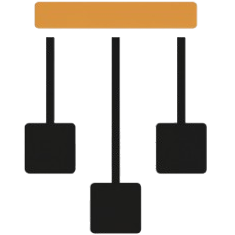

<picture>
  <source media="(prefers-color-scheme: dark)" srcset="assets/transparent_logo_dark.png">
  <source media="(prefers-color-scheme: light)" srcset="assets/transparent_logo.png">
  
</picture>

### Marionette

Deterministic I/O and simulation testing for Zig.

[](https://sb2bg.github.io/marionette/)
[](https://github.com/sb2bg/marionette/actions/workflows/ci.yml)
[](https://ziglang.org/download)
[](#status)
[](#license)

<hr>

Long term, Marionette is aiming to be the deterministic `std.Io` for Zig:
production libraries accept `std.Io`, and tests swap in Marionette's
deterministic implementation. Today, Marionette ships the simulator, trace,
fault, disk, and network primitives that make that direction concrete.

Marionette already runs real, unmodified Zig code under deterministic
simulation: a storage engine (`xit-vcs/xitdb`) and a cooperative-concurrency
library (`g41797/mailbox`), both with seed-reproducible replay, and has
surfaced reproducible recovery and correctness counterexamples in the process.

Today the demonstrated tiers are:

- deterministic `std.Io.File` storage simulation with crash/torn-write faults;
- cooperative `std.Io` task scheduling for `Mutex` / `Condition` code;
- scheduler-backed `std.Io.net` streams with deterministic latency,
  partitions, timeouts, healing, and retry;
- scheduler-aware disk operations that park tasks behind earlier deadlines;
- typed endpoint message passing with deterministic loss, latency, and
  partitions.

Write production-shaped code against `std.Io` plus any small Marionette handles
it actually needs, such as `mar.Recorder` or `mar.Endpoint(Message)`. In tests,
drive `control` to inject faults. For the modeled file and local endpoint
surfaces, the same application logic can run on the simulator and on production
adapters.

```zig
fn writeAndRecover(io: std.Io, root: std.Io.Dir, recorder: mar.Recorder) !KVStore {
    var store = try KVStore.init(io, root, recorder);
    try store.put(1, 41, .sync);
    try store.put(2, 99, .no_sync);
    try store.recover(.strict);
    return store;
}

// In simulation: deterministic, fault-injectable, replayable from a seed.
const sim = try world.simulate(.{ .disk = .{ .sector_size = 16 } });
var sim_store = try writeAndRecover(sim.env.io(), std.Io.Dir.cwd(), sim.env.recorder());

// In production: real disk, same code path.
var production = try mar.Production.init(.{ .root_dir = tmp.dir, .io = std.testing.io });
const prod_env = production.env();
var prod_store = try writeAndRecover(prod_env.io(), tmp.dir, prod_env.recorder());
```

For file-backed code like this, that parity is the point. You don't write a
"simulator version" of your code. You write your code behind Marionette-owned
authorities, and Marionette gives you a deterministic environment to run it in.

## Why

Distributed and storage systems fail in ways that are hard to reproduce: a torn write under crash, a network partition during quorum, a race between two timers. By the time you have a stack trace, the conditions that caused the bug are gone.

Deterministic simulation testing turns those bugs into seeds. Every run is reproducible. Every failure is replayable. You compress weeks of fuzz-testing into seconds, and when something breaks in CI, the seed alone is enough to debug it.

Marionette brings that approach to Zig. It's inspired by the techniques behind FoundationDB, TigerBeetle, and Antithesis, but designed to be a drop-in library, not a framework you build your system around.

## A complete example

Here's a WAL recovery test that crashes the disk mid-write, corrupts a sector, and asserts that committed records survive while unsynced ones don't.

```zig
pub fn scenario(harness: *Harness) !void {
    try harness.store.put(committed_key, committed_value, .sync);
    try harness.control.disk.setFaults(.{ .crash_lost_write_rate = .always() });
    try harness.store.put(volatile_key, volatile_value, .no_sync);
    try harness.control.disk.crash();
    try harness.control.disk.restart();
    try harness.control.disk.corruptSector(wal_path, record_size);
    try harness.store.recover(.strict);
}

pub const checks = [_]mar.StateCheck(Harness){
    .{ .name = "synced records recover, unsynced records are rejected", .check = recoveredStateIsSafe },
};

test "wal recovery" {
    try mar.expectPass(.{
        .allocator = std.testing.allocator,
        .seed = 0xC0FFEE,
        .init = Harness.init,
        .scenario = scenario,
        .checks = &checks,
    });
}

test "wal recovery fuzz" {
    try mar.expectFuzz(.{
        .allocator = std.testing.allocator,
        .seed = 0xC0FFEE,
        .seeds = 16,
        .init = Harness.init,
        .scenario = scenario,
        .checks = &checks,
    });
}
```

Three pieces, every test:

- **`init`** sets up your harness: your code under test, plus the `control` handle for fault injection.
- **`scenario`** drives the action. It calls into your code through the handles
  created by `env`, and into the simulator via `control`.
- **`checks`** assert invariants on the final state.

`expectPass` runs once with a fixed seed. `expectFuzz` runs many seeds in parallel. `expectFailure` asserts that a deliberately-buggy scenario gets caught, useful for proving your checker actually works.

## The two surfaces: `io` and `control`

Every Marionette test has two halves.

**`io`** is what production-shaped storage code should usually see. In
simulation, `sim.env.io()` returns Marionette's deterministic `std.Io` backend.
In production, `production.env().io()` returns the host `std.Io` supplied at
setup. Application code that wants trace events should accept a narrow
`mar.Recorder`, not all of `mar.Env`.

```zig
var store = try KVStore.init(io, root, recorder);
try store.put(1, 41, .sync);
```

**`control`** is what your test code uses to inject faults. It's only available in simulation. It mirrors `env`'s structure: every resource has a control surface.

```zig
try control.disk.crash();
try control.disk.corruptSector(path, offset);
try control.network.partition(&side_a, &side_b);
try control.network.setLossiness(.{ .drop_rate = .percent(20) });
try control.network.heal();
```

`Env` is still the harness-owned bundle that supplies `io()`, `recorder()`,
clock/random helpers, and remaining Marionette capabilities. Code that only
needs file I/O should prefer `std.Io` so it stays ordinary Zig code.

## Distributed simulation

Network simulation works the same way. Here's a partition test against a toy replicated register:

```zig
fn partitionScenario(harness: *Harness) !void {
    const isolated = [_]mar.NodeId{0};
    const majority = [_]mar.NodeId{ 1, 2, client_node_id };

    try harness.control.network.partition(&isolated, &majority);
    try harness.replicas.write(.{ .version = 1, .value = 41, .retry_limit = 2 });

    try harness.control.network.heal();
    try harness.replicas.write(.{ .version = 1, .value = 41, .retry_limit = 1 });

    try checkReplicaCommitted(&harness.replicas, 0, 1, 41);
}
```

Messages have configurable loss, latency, clogs, and partition dynamics through focused `control.network` calls such as `setLossiness(...)`, `setLatency(...)`, and `setPartitionDynamics(...)`. Application code sends through a node-scoped endpoint with `endpoint.send(to, message)` and receives with `while (try endpoint.receive()) |envelope|`.

## std.Io.net client/server validation

The external-style [`std_io_net_kv`](examples/std_io_net_kv.zig) example
imports only `std` and implements a fixed-frame PUT/GET service over
`std.Io.net`. In simulation, node-scoped `std.Io` handles come from
`sim.envForNode(node).io()`, so reconnecting sockets keep the same process
identity instead of consuming topology. Its Marionette harness partitions the
client from a queued response, surfaces the dropped delivery as `error.Timeout`,
heals the link, and retries the request. A correct server deduplicates the
retry; a planted buggy mode applies it twice and violates an exact revision
oracle.

```sh
zig build validate-std-io-net-kv
zig build run-example -- std-io-net-kv --seed 12648430 --trace
zig build run-example -- std-io-net-kv-bug \
  --seed 12648430 --trace --expect-failure
```

See [Testing std.Io.net Code Deterministically](docs/std-io-net-example.md) for
the trace and exact supported boundary. This is an external-style capability
demonstration, not a third-party SUT finding.

## Cooperative concurrency

Marionette has scheduler-backed cooperative `std.Io` tasks and futex waits for
`Mutex` / `Condition` code. `Io.async` and `Io.concurrent` run as deterministic
simulator tasks, and awaiting from either a task or the scenario drives the
same scheduler. The pinned `g41797/mailbox` validation target runs unmodified
and exercises timed receive, send/wake, same-deadline timeout ordering, and
byte-identical same-seed replay. The internal
`validate-bounded-queue` target adds a canonical FIFO oracle and a planted
lost-wakeup deadlock to demonstrate concurrency bug detection without counting
it as an external SUT finding. This is cooperative `std.Io` concurrency, not
preemptive OS thread or memory-model testing; see
[Std.Io Direction](docs/std-io-direction.md) for the exact boundary.

## Traces

Every run produces a structured trace. When a check fails, you get the full sequence of events that led to the violation, plus the seed to reproduce it.

```
register.write.start version=1 value=41 retry_limit=8
register.message kind=propose to=0 version=1 value=41
replica.accept replica=0 version=1 value=41 accepted=true
register.message kind=propose to=1 version=1 value=41
replica.accept replica=1 version=1 value=41 accepted=true
register.write.quorum version=1 value=41 acks=2
register.invariant_violation kind=committed_divergence replica=1 ...
```

You write trace records with `mar.Recorder` or, inside harness-shaped code,
`env.record(...)`. Application code, scenario code, and checks can all record.
Failed runs print the trace automatically. Passing runs hand it back to you so
you can persist it, diff it, or feed it to whatever observability you already
have.

## Docs

- [Overview](docs/overview.md)
- [Architecture](docs/architecture.md)
- [Trace Format](docs/trace-format.md)
- [Run](docs/run.md)
- [Findings](FOUND_BUGS.md)
- [API Target Spec](docs/api-target.md)
- [BUGGIFY](docs/buggify.md)
- [Network Model](docs/network.md)
- [Network API Direction](docs/network-api.md)
- [std.Io.net Client/Server Example](docs/std-io-net-example.md)
- [Disk Fault Model](docs/disk-fault-model.md)
- [API](docs/api.md)
- [Determinism](docs/determinism.md)
- [Examples](docs/examples.md)
- [Roadmap](docs/roadmap.md)
- [Prior art](docs/prior-art.md)
- [TigerBeetle Lessons](docs/tigerbeetle-lessons.md)
- [Releasing](docs/releasing.md)
- [Blog](docs/blog/index.md)

## Status

Marionette is early. This is a `0.x` release: there is no API stability
guarantee before 1.0. The intended-stable surface today is `World`, `Env`,
`Control`, `runCase` / `expect*`, `Disk`, `SimDisk`, `RealDisk`, `Production`,
`Recorder`, and the app-facing `Endpoint(Message)` shape. Everything else may
change as the simulator grows.

The simulator currently models clock, deterministic randomness, disk, a flat
`std.Io.File` subset, typed endpoint networking, a narrow scheduler-backed
`std.Io.net` stream subset with accept/read suspension plus latency and
send-time loss, delivery-time partitions, and deterministic healing, and
cooperative `std.Io` tasks and futex waits for `Mutex` / `Condition` code,
validated against the pinned `g41797/mailbox` target and the internal
bounded-queue capability demo. It does not model
arbitrary OS thread scheduling or memory-level concurrency; code that depends on
those needs separate testing. The production network path
is partial: local same-process endpoints and experimental framed loopback paths
exist, but cross-process production transport is still roadmap work. Allocator
simulation, cooperative cancellation points, `Io.Group`, queue suspension, and
broader scheduler parity are planned.

Scheduler-backed fibers are tested on Linux and macOS. The x86_64 Windows
fiber path is deliberately disabled until its Win64 entry ABI has execution
coverage. `RealDisk.syncDir` returns `error.DirectorySyncUnsupported` because
Zig 0.16 does not expose a portable directory-sync operation; it never reports
durability that it did not perform.

If you're building something where determinism matters and you want to try it, the [`examples/`](examples/) directory is the best place to start. Open issues and PRs welcome.

## Install

```
zig fetch --save https://github.com/sb2bg/marionette/archive/refs/tags/v0.3.0.tar.gz
```

Requires Zig 0.16.x.

## Acknowledgments

Marionette stands on the shoulders of [FoundationDB's simulation testing](https://apple.github.io/foundationdb/testing.html), [TigerBeetle's VOPR](https://tigerbeetle.com/blog/2023-03-28-random-fuzzy-thoughts), and the broader DST tradition. The bugs they catch are bugs everyone has; this library tries to make catching them easy in Zig.

## License

MIT
