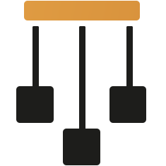

<picture>
  <source media="(prefers-color-scheme: dark)" srcset="assets/transparent_logo_dark.svg">
  <source media="(prefers-color-scheme: light)" srcset="assets/transparent_logo.svg">
  
</picture>

### Marionette

Deterministic I/O and simulation testing for Zig.

[](https://sb2bg.github.io/marionette/)
[](https://github.com/sb2bg/marionette/actions/workflows/ci.yml)
[](https://ziglang.org/download)
[](#status)
[](#license)

<hr>

Marionette makes failures involving time, disk, networking, and cooperative
concurrency reproducible. Write production-shaped code against `std.Io`, run
it under deterministic simulation, inject faults from your test, and replay a
failure from its seed and trace.

The long-term target is a deterministic `std.Io` for Zig. Today, Marionette
provides the simulator, fault models, structured traces, replay checks, and the
current file, network, and scheduler-backed I/O subsets needed to test real
systems code.

## Why deterministic simulation?

A torn write during recovery, a response arriving just after a timeout, or a
late completion racing a new lease may appear once in millions of ordinary
test runs. In Marionette, simulated choices come from a seed and every run
produces a structured trace. When a check fails, the same seed recreates the
same execution.

Marionette is a library, not a production runtime or a framework that owns your
application. Your composition root supplies explicit I/O authorities, but ordinary
unit tests still belong in `std.testing`.

## What a failure looks like

In this shortened failure trace, a crash tears an unsynced WAL record. Buggy
recovery accepts the damaged record, and a named invariant check turns the
execution into a replayable failure:

```text
disk.crash_write op=4 path=kv.wal offset=16 len=16 result=torn
kv.recover.record offset=16 key=2 value=0 mode=buggy_accept_magic_only
kv.invariant_violation reason=unsynced_record_recovered

marionette failure: kind=check_failed seed=12648430
  error=UnsyncedRecordRecovered
  check="synced records recover and unsynced records are rejected"
```

The trace preserves the path to the failure and the seed reproduces it. The full
scenario lives in [`examples/kv_store.zig`](examples/kv_store.zig).

## How it fits

Marionette separates the code under test from the test's fault controls:

| Surface   | Used by                      | Role                                                                       |
| --------- | ---------------------------- | -------------------------------------------------------------------------- |
| `std.Io`  | Application code             | File, network, time, and cooperative task operations                       |
| `Env`     | Composition and harness code | Supplies `io()`, recording, allocation, and remaining capabilities         |
| `Control` | Simulation tests only        | Injects crashes, corruption, loss, latency, partitions, and process events |

Production code receives host `std.Io`, simulation receives Marionette's
deterministic implementation. The application path stays the same while the
test gains explicit control over failures.

An abridged disk-recovery test has three pieces: initialize application state,
drive a scenario through the application and `Control`, then check the final
state.

```zig
const Case = mar.SimCase(KVStore);

fn scenario(case: *Case) !void {
    try case.app.put(1, 41, .sync);
    try case.control().disk.setFaults(.{
        .crash_lost_write_rate = .always(),
    });
    try case.app.put(2, 99, .no_sync);
    try case.control().disk.crash();
    try case.control().disk.restart();
    try case.control().process.restart(0);
    try case.app.reopen();
    try case.app.recover(.strict);
}

const checks = [_]mar.StateCheck(Case){
    .{ .name = "only durable records recover", .check = recoveredStateIsSafe },
};

test "WAL recovery is deterministic" {
    try mar.expectSimPass(.{
        .allocator = std.testing.allocator,
        .seed = 0xC0FFEE,
        .simulate = mar.World.SimulateOptions{
            .disk = .{ .sector_size = 16 },
        },
        .init = init,
        .scenario = scenario,
        .checks = &checks,
    });
}
```

The complete, runnable version is
[`examples/kv_store.zig`](examples/kv_store.zig). `expectSimPass` runs the case
twice and compares traces, `expectSimFuzz` repeats that replay check across
derived seeds. Advanced harnesses can supply a strictly ordered
`seed_schedule` to reset the random stream at a simulated-time/random-call
microstep; schedules are same-build controls rather than cross-version replay
artifacts.

## Install

Marionette requires Zig 0.16.x.

```sh
zig fetch --save https://github.com/sb2bg/marionette/archive/refs/tags/v0.7.0.tar.gz
```

Add the module to your test build:

```zig
const marionette = b.dependency("marionette", .{
    .target = target,
    .optimize = optimize,
});
tests_module.addImport("marionette", marionette.module("marionette"));
```

Then import it in Zig:

```zig
const mar = @import("marionette");
```

## What it can simulate

- Seeded randomness, virtual time, structured traces, and byte-identical replay.
- A directory-aware `std.Io.File` / `Dir` subset with lost, torn, reordered,
  corrupt, and failed disk operations.
- Scheduler-backed `std.Io.net` streams with latency, timeouts, loss,
  partitions, healing, and process lifecycle events.
- Cooperative `std.Io` tasks, groups, cancellation, and futex waits used by
  `Mutex` / `Condition` code.
- Structured deadlock and scheduler failures with compact wait-state traces,
  plus an opt-in worker watchdog for non-yielding loops and livelocks.
- Deterministic allocation faults and an explicit transition from fault
  exploration to liveness checking.
- Experimental typed endpoints for testing protocol and state-machine behavior
  above the wire.

## Evidence on real code

Marionette's boundaries are exercised against pinned, unmodified Zig projects,
not only simulator-native examples:

| Boundary                           | Validation target     |
| ---------------------------------- | --------------------- |
| Storage and crash recovery         | `xit-vcs/xitdb`, Ochi |
| Cooperative concurrency            | `g41797/mailbox`      |
| HTTP over `std.Io.net`             | `lalinsky/dusty`      |
| Queue protocol and process restart | `g41797/beanstalkz`   |

These campaigns have validated robust behavior and uncovered confirmed bugs in real third-party code. The [findings ledger](FOUND_BUGS.md) distinguishes confirmed system-under-test bugs from simulator boundaries and harness/model mistakes.

## Status

Marionette is alpha software. It is a `0.x` release with no API stability guarantee before 1.0.

The simulator covers deliberate subsets of `std.Io`, it is not syscall
interception and cannot make arbitrary nondeterministic code deterministic. It
does not model preemptive OS-thread scheduling, the CPU memory model, or real
DNS. Scheduler-backed fibers are tested on Linux and macOS, and the x86_64 Windows
fiber path is currently disabled. Typed `Endpoint(Message)` networking remains
experimental.

For exact contracts and unsupported behavior, see the
[`std.Io.net` conformance matrix](docs/std-io-net-conformance.md),
[disk fault model](docs/disk-fault-model.md), and [architecture](docs/architecture.md).

## Documentation

- **Start -** [examples](docs/examples.md) and the [simulation runner](docs/run.md)
- **Understand the design -** [architecture](docs/architecture.md) and [determinism contract](docs/determinism.md)
- **Use the library -** [API reference](docs/api.md), [determinism contract](docs/determinism.md), and [trace format](docs/trace-format.md)
- **Follow the project -** [roadmap](ROADMAP.md), [findings](FOUND_BUGS.md), and the [technical blog](docs/blog/index.md)

The complete documentation is published at [sb2bg.github.io/marionette](https://sb2bg.github.io/marionette/).

## Acknowledgments

Marionette builds on the deterministic simulation testing tradition of [FoundationDB](https://apple.github.io/foundationdb/testing.html), [TigerBeetle](https://tigerbeetle.com/blog/2023-03-28-random-fuzzy-thoughts), and Antithesis.

## License

MIT
